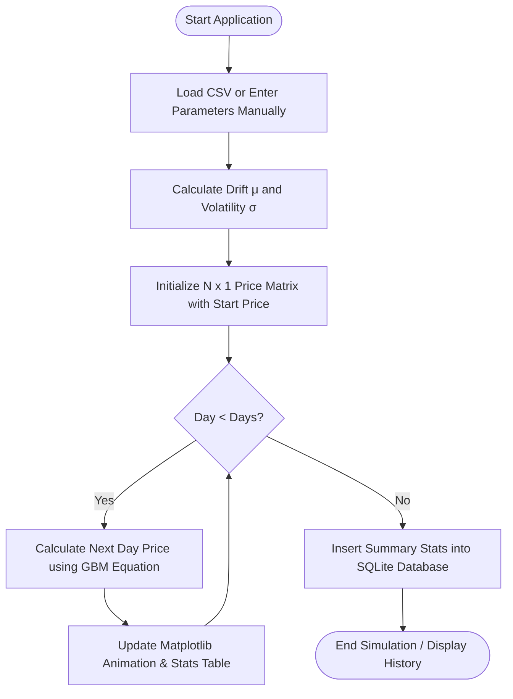
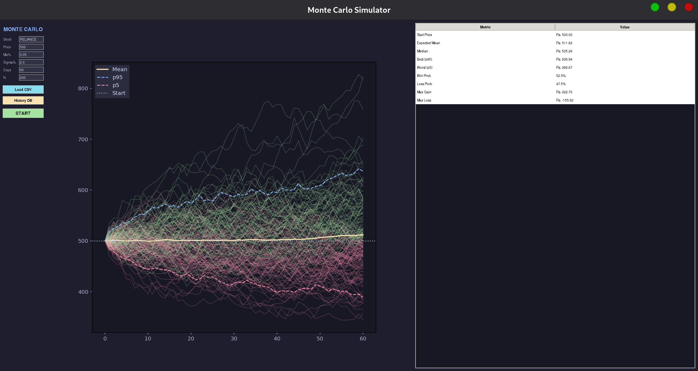
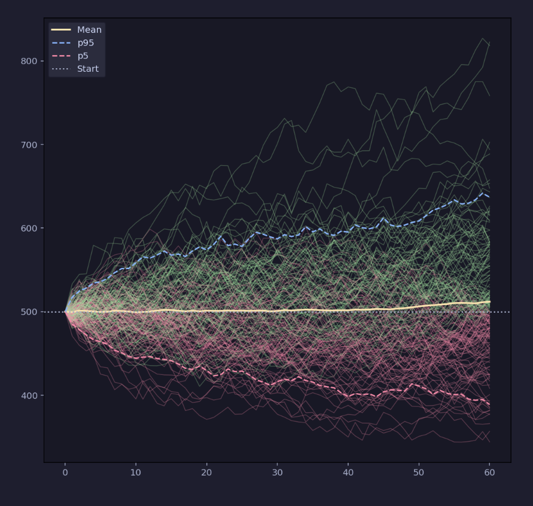
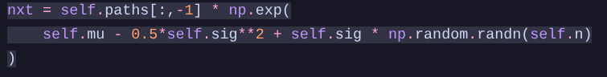
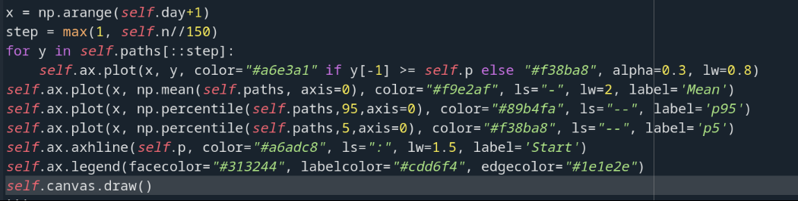
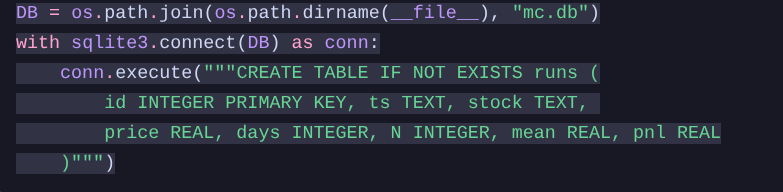

# Monte Carlo Stock Price Simulator

[](https://www.python.org/)
[](https://docs.python.org/3/library/tkinter.html)
[](https://pandas.pydata.org/)
[](https://matplotlib.org/)
[](https://www.sqlite.org/index.html)

A comprehensive, interactive desktop application written in Python that forecasts future stock price trajectories using a stochastic **Geometric Brownian Motion (GBM)** model. The simulator ingests historical market data from CSV files to dynamically calculate volatility and average returns, runs thousands of parallel simulations in real-time, displays interactive stats via a Pandas-backed dashboard, and logs all simulation runs into a local SQLite database for history tracking.

---

## 🚀 Key Features

- **Geometric Brownian Motion (GBM) Modeling:** Implements the classic stochastic process used by financial institutions for asset price forecasting.
- **Interactive Tkinter GUI:** A modern, dark-themed desktop interface styled with Catppuccin-inspired aesthetics (`#1e1e2e` Mocha background).
- **Live-Animated Plotting:** Interactive real-time simulation progress rendering using Matplotlib, including:
  - Dynamic percentile envelopes (5th percentile `p5` and 95th percentile `p95`).
  - Expected average trajectory line (Mean).
  - Profit/Loss color-coded path coloring (Green for gains, Red for losses).
- **Automated CSV Ingestion:** Load historical stock data (CSVs) to auto-calculate the asset's daily drift ($\mu$) and volatility ($\sigma$).
- **Pandas Statistics Dashboard:** Provides instant metrics on completion, including:
  - Expected Mean, Median, Max Gain, and Max Drawdown.
  - Probability of profit/loss based on simulated path endpoints.
- **Run History Persistence:** Local SQLite database integration logging all previous simulation runs with stock name, start price, parameters, and final PnL. Contains an interactive history viewer to query previous simulations.

---

## 📈 System Architecture & Data Flow

The flowchart below demonstrates how user input transitions into mathematical modeling, then visual output, and finally persistent storage:



---

## 🧮 Mathematical Foundation

The future stock prices are modeled using **Geometric Brownian Motion (GBM)**, a continuous-time stochastic process in which the logarithm of the randomly varying quantity follows a Brownian motion (also called a Wiener process) with drift.

The price trajectory of the stock is governed by the following stochastic differential equation:

$$S_t = S_{t-1} \cdot e^{\left(\mu - \frac{1}{2}\sigma^2\right)\Delta t + \sigma Z \sqrt{\Delta t}}$$

Where:
- $S_t$ is the stock price at time $t$.
- $S_{t-1}$ is the stock price at the previous time step.
- $\mu$ is the **drift coefficient** (representing the expected average daily return).
- $\sigma$ is the **diffusion coefficient / volatility** (representing the historical standard deviation of daily returns).
- $Z$ is a random variable drawn from a **standard normal distribution** ($Z \sim N(0, 1)$).
- $\Delta t$ is the time step size (assumed to be $1\text{ day}$ in this simulator).

---

## 🖥️ Application Screenshots

### Main Interface
The user interface features control inputs, live statistical tables, and an animated plotting workspace.


*Figure 1: Tkinter GUI with Pandas statistics dashboard, input parameters, and loaded historical stock metrics.*

### Live Matplotlib Simulation Plot
When simulating, the paths are animated day-by-day. Winning and losing trajectories are distinguished by color, with boundary envelopes indicating high-probability limits.


*Figure 2: Close-up of the Matplotlib simulation paths with Mean, p5 (lower bound), and p95 (upper bound) indicators.*

---

## 🛠️ Code Implementations

Below are key code snippets extracted from the core implementation illustrating the database configuration, path calculation logic, and visualization setups.

### 1. Stochastic Path Calculation Logic (GBM)
The core logic utilizes vector-based NumPy operations to calculate the next day's price for all $N$ simulations simultaneously, keeping the execution extremely fast.


*Figure 3: Code snippet showing Geometric Brownian Motion implementation using NumPy vectorized math.*

### 2. Live Visualization Pipeline
Matplotlib handles the plotting of path lines, mean trajectories, and percentile bounds. Winning paths are colored green (`#a6e3a1`) and losing paths red (`#f38ba8`).


*Figure 4: Code snippet showing Matplotlib path rendering and legend mapping.*

### 3. History Database Configuration
SQLite3 is utilized to persist the results of every completed simulation run.


*Figure 5: Code snippet showing SQLite database schema initialization and run insertions.*

---

## ⚙️ Installation & Usage

### Prerequisites
Make sure you have Python 3.8 or higher installed on your local machine.

### 1. Clone the Repository
```bash
git clone https://github.com/shrijan-adhikari/Monte-carlo-simulation.git
cd monte-carlo-simulator
```

### 2. Set Up Virtual Environment (Recommended)
```bash
# Create virtual environment
python3 -m venv venv

# Activate on Linux/macOS
source venv/bin/activate

# Activate on Windows
venv\Scripts\activate
```

### 3. Install Dependencies
Install the required packages using pip:
```bash
pip install numpy pandas matplotlib
```
*Note: Tkinter and SQLite3 are included in the Python Standard Library.*

### 4. Run the Application
Start the simulator by running the main Python file:
```bash
python monte-final.py
```

---

## 📊 CSV Data Preparation

The simulator expects CSV files with historical stock prices to extract parameters automatically. Ensure your CSV has at least one of these columns (case-insensitive):
- `Close`
- `close`
- `Price`

#### Example Format:
```csv
Date,Open,High,Low,Close,Volume
2023-01-02,1814.96,1824.63,1813.17,1822.62,4944655
2023-01-03,1832.45,1851.55,1828.16,1836.70,1446848
2023-01-04,1856.79,1877.69,1823.86,1849.38,1414982
```
*You can find sample stock CSV histories for Adani Enterprises (`ADANIENT`), Adani Ports (`ADANIPORTS`), and Adani Green (`ADANIGREEN`) in the `adani/` directory.*

---

## 💾 SQLite Database Schema

The historical runs are saved in a table named `runs` within a local database named `mc.db`:

```sql
CREATE TABLE IF NOT EXISTS runs (
    id INTEGER PRIMARY KEY AUTOINCREMENT,
    ts TEXT,          -- Timestamp of the run (ISO format)
    stock TEXT,       -- Stock ticker/name
    price REAL,       -- Initial starting price
    days INTEGER,     -- Simulation duration in days
    N INTEGER,        -- Number of simulated paths
    mean REAL,        -- Final expected mean price
    pnl REAL          -- Final expected Profit/Loss percentage
);
```

---

## 🔮 Future Enhancements

- **Live Market Ingestion:** Integrate live financial APIs (e.g., Yahoo Finance API via `yfinance`) to fetch current prices and volatilities in real-time.
- **Multivariate Portfolio Simulation:** Extend the simulation logic from a single stock to a portfolio of assets, incorporating historical correlation matrices.
- **Web-based Dashboard:** Convert the desktop Tkinter interface into a modern web dashboard using Flask/Django backend and React/Next.js frontend.

---

## 📚 References

1. **MIT OpenCourseWare:** *Monte Carlo Simulation Lecture*. [Watch on YouTube](https://youtu.be/OgO1gpXSUzU)
2. **Practical Business Python:** *Monte Carlo Simulation with Python*. [Read Article](https://pbpython.com/monte-carlo.html)
3. **GitHub Reference:** *Monte-Carlo-Stock-Simulator*. [View Repository](https://github.com/tubakhxn/Monte-Carlo-Stock-Simulator)
